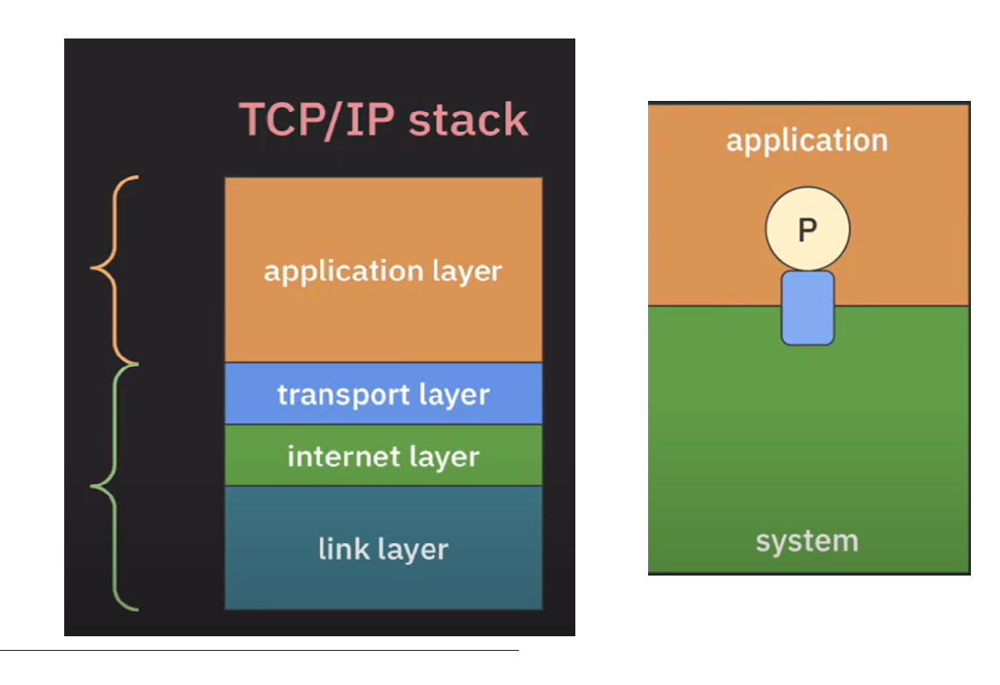
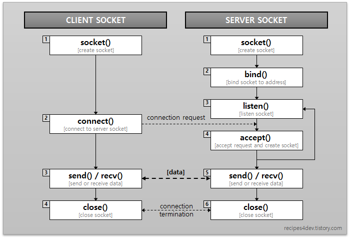

## 목표

### 1차 목표

클라이언트가 서버에 텍스트를 보내면 그대로 응답하는 에코 서버를 구현한다.

### 2차 목표

- 서로 다른 클라이언트가 통신할 수 있도록 구현한다.

### 최종 목표

- 메세지를 TLS로 감싼다.

### 참고
- 서버를 데몬으로 구현한다.
- 리눅스 환경에서 구현한다.

# 개념 정리

### 소켓과 포트

https://youtu.be/X73Jl2nsqiE?si=m99GEhdwjbzp-FB1

### OSI 7 Layer vs TCP/IP stack

- OSI 7 Layer: 네트워크 시스템 구성을 위한 개념적인 모델
- TCP/IP stack: 인터넷이 발명되면서 함께 개발된 프로토콜 스택. RFC(문서)로 관리
    - TCP, UDP, IP 스펙은 RFC에서 정의한다.
    - OSI의 transport, network 계층과 대응된다.

### 소켓과 포트에 대한 이해

TCP/IP stack의 발전과 함께 나온 개념이기 때문에 TCP/IP 관점에서 이해해보자.

Port

스택을 크게 하드웨어, 운영체제에서 관리하는 **시스템 영역**과 애플리케이션에서 관리하는 **애플리케이션 영역**으로 나눌 수 있다. **프로세스가 데이터를 송수신하기 위해 시스템과 연결된 통로**를 port라고 한다. 

TCP/IP

프로세스가 다른 호스트의 프로세스와 통신하기 위해서 Internet Protocol을 사용한다. IP는 데이터가 유실될 수 있고 패킷의 순서가 보장되지 않는다는 특징이 있다. 그래서 안정적으로 통신하기 위해 TCP을 사용한다. TCP는 연결 지향 프로토콜로, 데이터를 주고 받는 통신 앞 뒤로 연결 통로를 생성하고 해제하는 과정을 거친다. 연결하는 과정에서 통신에 필요한 셋업과정을 거치고, 해제하는 과정에서 사용했던 자원을 반환한다. 

Socket

인터넷 상에서 포트를 식별하기 위해 IP주소와 port number를 사용한다. IP 주소로 먼저 호스트를 식별하고 port number로 포트에 접근한다. **IP 주소와 port number를 합친, 주소의 개념**을 소켓이라고 한다. TCP 표준에서 한 쌍의 Socket으로 각 Connection을 고유하게 식별하고, 한 소켓은 여러 Connection과 연결할 수 있다고 정의한다.

Socket(구현의 관점)

TCP, UDP 자원과 관련된 커널 모드에 접근하기 위해서 프로세스가 사용하는 프로그래밍 인터페이스를 소켓이라고 한다. 개발자는 소켓 프로그래밍을 통해 인터넷 상의 다른 프로세스와 통신할 수 있다. 

### 그래서 소켓은?

프로세스 간의 데이터 통신에서 IP주소와 포트 번호랑 바인딩되어 사용하는 인터페이스 혹은 엔드포인트라고 할 수 있다. 운영체제의 관점에서 유저 모드 애플리케이션이 커널 모드의 TCP 자원에 접근하기 위해 사용되는 인터페이스로서의 소켓과 네트워크의 관점에서 통신하는 프로세스들의 Connection의 엔드포인트에 해당하는 소켓이 있다. 참고로 Connection을 고유하게 만들기 위해서 클라이언트 ip, port와 서버 ip, port를 합친 4가지 항목으로 식별한다.

- 종류
    - TCP, UDP 소켓
    - 클라이언트, 서버 소켓. 서버는 다시 리스너 소켓, 송수신 소켓으로 나뉜다.

### 전체 흐름

- bind: 소켓과 ip, port를 결합한다.
- listen: 클라이언트가 요청할 때까지 대기한다.
    - listen(): 반환값은 수신이 됐는지 안됐는지 뿐이다. → 클라이언트 정보는 모른다.
    - 클라이언트의 정보는 시스템 내부 큐에 쌓이게 되고, accept() 호출 후에 연결이 완료된다.
- accept: 클라이언트의 요청이 있으면, 송수신할, 새로운 소켓을 만든다.

### 참고사항

- 소켓을 생성할 때는 타입을 지정할 수 있다. TCP 소켓으로 Stream, UDP 소켓으로 Datagram.
- 클라이언트 소켓의 recv()는 통신의 시기를 정할 수 없기 때문에 별도의 쓰레드에서 해결한다.
- 각 소켓은 시스템이 관리하는 포트 중에 하나의 포트 번호를 사용하게 된다.
- user mode 프로세스가 커널에 접근하기 위한 인터페이스를 File이라 한다.
    - 만약 kernel mode 의 추상체가 TCP/IP 일 경우의 File을 Socket이라고 한다.
    - 따라서 File의 I/O 문법이 그대로 적용된다.

## 참고

- https://recipes4dev.tistory.com/153
- https://www.youtube.com/playlist?list=PLXvgR_grOs1A4C8-Q64yizWA49iN1rgtv
- https://m.blog.naver.com/iwsdi/221400697699
